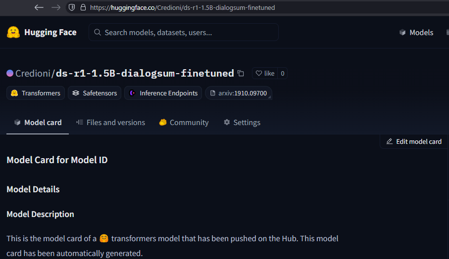
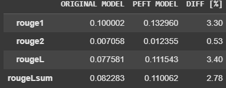

# COMP.CS.530 Fine-Tuning LLMs - Technical Exercise 5

A Deepseek model `deepseek-ai/DeepSeek-R1-Distill-Qwen-1.5B` fine-tuned against dataset `neil-code/dialogsum-test`.\
Trained for **500 steps**.\
\
\
**Errors fixed and Major changes** ⚠️:\
Fixed - `pip install pynvml`\
Added - `Table of Content`\
Added - `Comments for new stuff`

\
**Model Details**\

\
\
**Evaluation**\
